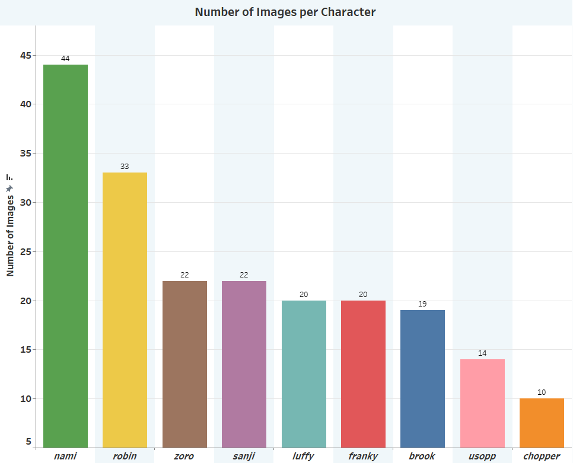
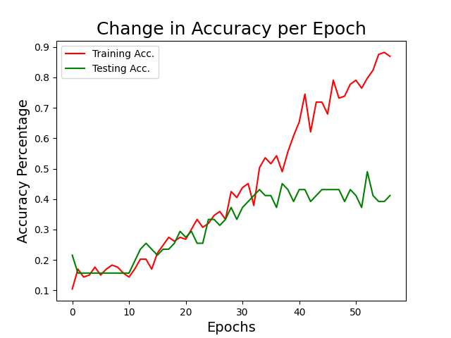
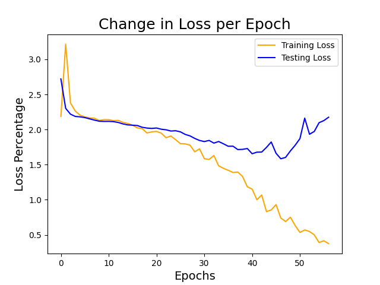

# Straw Hat Fanart Classifier
### *by Daniel Preston McBride*
https://www.linkedin.com/in/danielpmcbride/ 
https://www.github.com/DanielPrestonMc

---

## Contents:

- [Background/Problem Statement](#Background-&-Problem-Statement)
- [The Data](#The-Data)
- [Python Files](#Jupyter-Lab-Notebook-Files)
- [Python Libraries & Packages](#Python-Libraries-&-Packages)
- [Image Scraping & Transformation](#Image-Scraping-&-Transformation)
- [Exploratory Data Analysis](#Exploratory-Data-Analysis)
- [Modeling](#Modeling)
- [Results](#Results)
- [Application](#Application)
- [Conclusion](#Conclusion)

---

## Background & Problem Statement

Anime fans are some of the most loyal and dedicated fanbase that exists. Many fans take that dedication to new heights, such as creating cosplay, fan fiction, or community meetup groups and unofficial fan accounts and subreddits.  One talented group of fans also use their creativity and talents to express their own unique perspectives of their favorite characters through fanart.

What is the measure of good fanart though? How much does it matter that the character in the illustration actually represents the original character? And in this project specifically, how well can image classification utilizing a neural network perform with anime character fanart created in unique and stylish ways but still representing the original character?

The goal of this project is to develop an application that allows 'One Piece' fanart illustrators to submit their creations (the wilder and crazier the better!) and see how accurately the app can classify the artwork by character.

---

## The Data

The training image data was scraped from www.myanimelist.net and www.animecharactersdatabase.com

[Luffy Image Data](assets/luffy/) - This folder contains image data for the character 'Luffy'.
 
[Zoro Image Data](assets/zoro/) - This folder contains image data for the character 'Zoro'.
 
[Nami Image Data](assets/nami/) - This folder contains image data for the character 'Nami'.
 
[Sanji Image Data](assets/sanji/) - This folder contains image data for the character 'Sanji'.
 
[Chopper Image Data](assets/chopper/) - This folder contains image data for the character 'Chopper'.
 
[Robin Image Data](assets/robin/) - This folder contains image data for the character 'Robin'.
 
[Franky Image Data](assets/franky/) - This folder contains image data for the character 'Franky'.
 
[Brook Image Data](assets/brook/) - This folder contains image data for the character 'Brook'.
  
[Usopp Image Data](assets/usopp/) - This folder contains image data for the character 'Usopp'.
  

---

## Python Files

[Scraper Function](code/scraper.py)
 
[Scraping Image Data from myanimelist.net](code/01_scraping_characters.py)
 
[Scraping Image Data from animecharactersdatabase.com](code/01_scraping_characters_2.py)
 
[Creating dataframe with character name and image path info](code/02_images_to_df.py)
 
[Exploratory Data Analysis](code/03_eda.py)
 
[CNN Model](code/04_cnn_model.py)
 
[Flask App Deployment](flask_app/cap_app.py)
 

---

## Python Libraries & Packages

Numpy, Pandas, Requests, Time, os, bs4(BeautifulSoup), TensorFlow, Sklearn

---

## Image Scraping & Transformation

The image data was scraped from myanimelist.net and animecharactersdatabase.com using Beautiful Soup(bs4). A scraper function was constructed that could accept a character's specific html attributes so too much data is not scraped. From there, the images were downloaded locally using the request.get method on the image url. Of course, specifically for animecharactersdatabase.com, I paid special attention to “faking” the headers for my requests and adding time.sleep before each requests to ensure I wouldn’t get banned! (based on the sites specific instructions surround scraping their site).  They did offer custom API support, but they also charged for it, so I just scraped instead.

A tensorflow preprocessing method called image_dataset_from_directory converted the local images to tensor array data, which was then converted to numpy array data for use with the neural network model. But before the array data could be used, it was wise to transform the contents of each arrays from values between 0 and 255 to values between 0 and 1. Neural networks usually do a better job working with data in these ranges.

---

## Exploratory Data Analysis

Some initial EDA after acquiring all the image data showed some variation in available images for each character.  This could definitely have an impact on how well the model will perform at classifying one character with a larger number of images, such as Nami (who makes up the baseline with roughly 22% of the image data), vs a character with a smaller number like Chopper. (which I personally find tragic since Chopper is adorable).

Image analysis was generated using Tableau.

---

## Modeling

The decision was made to utilize a Convolutional Neural Network, which is usually best for image data.  First, Conv2D layers and MaxPooling2D layers were built out to add a variety of filters to each piece of image data that the model can train on.  This allows for better adaptation to more obscure pieces of test data.  After adding a Flatten layer to make the data accessible for input into the dense neural network, dense layers and dropout layers were added to train the model.

---

## Results

The model was measured on the accuracy of predicting the correct category(or character) for each piece of image data.  In an initial model had a best performance accuracy score (CLICK) of roughly 66% on the testing data at one point, but unfortunately this was with a much smaller amount of image data to train on and was actually very overfit, so it did not predict on unknown data very well.

After adding more image data and making adjustments to the model, I ended up with a lower accuracy score of roughly 50%.  While this is still better than the baseline score of just 22%, it proved much more difficult to account for so many different variations in the data to predict even more accurately on unknown data.  A much deeper model with supporting processing power could possibly make the difference in this situation.  The testing accuracy of the model begins to level out around the 35th epoch at roughly 45% before the early stopping kicks in while the loss percentage begins to level around the same epoch and eventually starts to trend back upward.

In future trials, the implementation of BatchNormalization as well as Principle Component Analysis could help reduce the complexity of the image data, helping the model predict better.  Also, testing out alternative models, such as OpenCV, or alternative model architecture that utilizes more powerful computing capabilities.

---

## Application

The web application was deployed using Flask and loaded in our trained model to accept new image data to predict on via a file input html button.  After a new file was submitted, it was ran through the model using the model.predict method.  The next screen of the web app will print out the character name prediction in text as well as posting the user submitted image side by side with an actual character image used to originally train the model.

The next step would be to make the application accessible online, but unfortunately, there were some compatibility issues with tensorflow and heroku, a cloud platform as a service.  I plan to either make some adjustments to the code and libraries or utilizing alternatives to heroku for cloud deployment.

---

## Conclusion

In conclusion, the application definitely has the potential to create a fun, interact online environment for fanart illustrators to test their ability, fool the system, or for non-fans to understand who a particular piece of fanart is suppose to represent.

The application can also be expanded to include more characters from the show, other characters from other shows and mediums, including but not limited to 2D animation, 3D animation, such as in animated shows or video games, and even live-action television and movie characters.

This experiment can be limited by local or cloud storage capacity for image data as well as CPU processing power for deeper neural network computations on larger amounts of data.

Risks for the experiment can include potential copyright infringement issues with character owners, depending on the intended deployment of the application.  Also, using user-created fanart without proper authorization could lead to potential roadblocks in testing, as well as locally saving user submitted images without properly communicating with users.  Another potentially larger risk with using a model like this is training on image data of real people and creating a privacy issue.

We can assume that the model will never perform with 100% accuracy because the user submitted images may have varying degrees of character recognition based on the artistic abilities of the user or purposefully obscuring a character illustration through creative expression.  With more image data being trained on by the model, particularly the more obscure characterization images, then better the model may be at prediction more unique illustrations.

Ultimately, I believe at a bare minimum, the application can create some fun interactions for fans of various mediums, and the potential for expansion as an image recognition tool is apparent.
